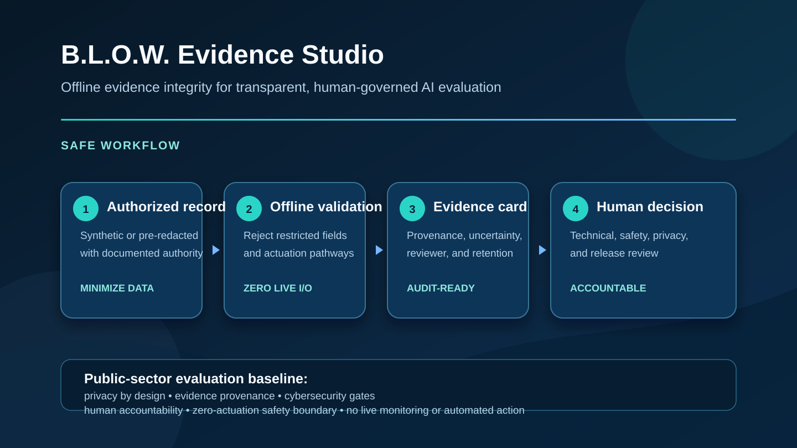
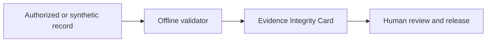

# B.L.O.W. Evidence Studio

**Bistatic Locator & Observation Workbench** is an offline, privacy-first AI governance and evidence-integrity project for authorized, redacted observation records.

It produces human-reviewable evidence cards from synthetic fixtures or records that an organization is explicitly authorized to use. It does not use hardware, networks, live sensors, targeting, identity resolution, tracking, aircraft control, or physical action.

`offline AI governance` · `evidence integrity` · `data provenance` · `synthetic data evaluation` · `privacy by design` · `human-in-the-loop AI` · `audit-ready reporting` · `cybersecurity`

> [!IMPORTANT]
> B.L.O.W. Evidence Studio is not a countermeasure, drone-intervention, surveillance, or enforcement product. Do not connect it to live devices, vehicle controls, real-time feeds, or automated decisions. Do not make up performance, compliance, safety, or authority claims.



## Public-sector evaluation and procurement

B.L.O.W. Evidence Studio is designed for public-sector evaluation teams, research programs, safety offices, and acquisition stakeholders that need to examine an AI evidence workflow without approving a live surveillance or intervention system. It makes the questions that matter during a responsible acquisition review visible from the start: **What data is authorized? What can the software do? What is prohibited? Who reviews the result? How is it retained or removed?**

- **Procurement-ready documentation:** a concrete data boundary, threat model, security policy, SOP, test suite, and source-backed claim rules.
- **Evidence before inference:** each local record carries provenance, authorization, known limitations, reviewer identity, and a retention date.
- **Zero-actuation by design:** the package rejects prohibited fields and has no network, hardware, device-control, location, identity, targeting, or intervention interfaces.
- **Decision support, not automated authority:** release requires named human review; the software never makes a physical, enforcement, or operational decision.
- **Truthful maturity signals:** the repository distinguishes what is implemented today from future work and makes no certification, authority, detection, performance, or compliance claim that it cannot substantiate.

For the decision-ready overview, see the [procurement readiness brief](docs/PROCUREMENT_READINESS.md) and the [evidence-review SOP](docs/SOP_EVIDENCE_REVIEW.md).

## What this project does

- Validates local, already-redacted evidence records.
- Requires an explicit `has_actuation: false` safety boundary.
- Rejects location, trajectory, target, identifier, and device-identifier fields.
- Makes provenance, data authorization, uncertainty, limitations, reviewer, and retention visible in every Evidence Integrity Card.
- Creates a foundation for offline AI evaluation, privacy-preserving data governance, and reproducible documentation.



## Quick start

Requires Python 3.10 or later. The included fixture is synthetic and contains no location, identity, tracking, or real-world performance data.

```bash
python -m blow_observation data/fixtures/synthetic_observation.json
python -m unittest discover -s tests -v
```

To write a local Markdown review packet:

```bash
python -m blow_observation data/fixtures/synthetic_observation.json --output evidence-card.md
```

## Evidence Integrity Card

Every accepted record must include:

| Field | Why it matters |
| --- | --- |
| `event_id` | Gives the record a stable audit reference. |
| `source_type` | States whether the record is synthetic, authorized, redacted, rights-cleared, or a manual note. |
| `data_authorization` | Prevents silent use of data with unclear rights. |
| `known_limitations` | Separates evidence from inference and makes uncertainty visible. |
| `review_status` and `reviewer` | Preserves human accountability before release. |
| `retention_expires_at` | Supports privacy-aware deletion and data minimization. |
| `has_actuation: false` | Enforces the project's zero-actuation boundary. |

See the [synthetic fixture](data/fixtures/synthetic_observation.json) and [data-governance policy](docs/DATA_GOVERNANCE.md).

## Cybersecurity and privacy defenses

- **Zero live I/O in the application package:** unit tests reject prohibited imports and data fields.
- **Least-privilege automation:** GitHub Actions use read-only permissions except where CodeQL requires security-event uploads.
- **Static analysis:** CodeQL scans Python on push, pull request, and a weekly schedule.
- **Dependency hygiene:** Dependabot tracks GitHub Actions updates; pull requests receive a dependency review.
- **Secret protection:** enable GitHub secret scanning and push protection in repository settings before accepting collaborators.
- **Secure release gates:** documented code-owner, branch-protection, human-review, and data-retention rules are in [SECURITY.md](SECURITY.md) and the [threat model](docs/THREAT_MODEL.md).

No security control eliminates risk. Treat all AI output, external contributions, and imported data as untrusted until reviewed.

## Frequently asked questions

### What is B.L.O.W. Evidence Studio?

It is an offline evidence and AI-evaluation workbench. It converts an already-authorized, already-redacted local record into a transparent Evidence Integrity Card for human review.

### Does B.L.O.W. detect, track, identify, or intervene with drones or aircraft?

No. This repository deliberately excludes live sensing, real-time tracking, targeting, identity resolution, interference, vehicle control, and physical intervention.

### What data can be processed?

Only synthetic fixtures and records with documented authority that have been redacted before import. Raw coordinates, trajectories, operator information, device identifiers, serial numbers, targets, and live streams are rejected.

### Can AI make a final decision from a record?

No. AI can assist with drafting and evaluation only. A named human reviewer is required before a record is marked reviewed or released.

### How are claims validated?

Every claim must be tagged as `measured`, `simulated`, or `unverified`, tied to a reproducible test or source, and approved through the review workflow in the [safe rebuild brief](docs/SAFE_REBUILD_BRIEF.md). Simulation is never presented as field performance.

### Why is an offline-first design important?

It narrows the attack surface, reduces unnecessary data exposure, and makes it easier to preserve clear provenance and human accountability.

## Project status and roadmap

The current release is a safe foundation: local schema validation, a synthetic fixture, review-card output, security workflows, and governance documentation.

Next safe milestones:

1. Add a public claim register with sources, confidence, and reviewer sign-off.
2. Version approved synthetic datasets with DVC after a data-steward review.
3. Add redaction tests and a retention-deletion checklist.
4. Add reproducible evaluation metrics only for offline, authorized test data.

## SEO and answer-engine metadata

Repository description, topics, natural-language questions, and copy-ready social metadata are maintained in [SEO_AEO_METADATA.md](docs/SEO_AEO_METADATA.md). The approach uses clear user-intent language and source-backed answers rather than keyword stuffing.

Suggested GitHub topics: `ai-governance`, `responsible-ai`, `evidence-integrity`, `data-provenance`, `synthetic-data`, `privacy-by-design`, `human-in-the-loop`, `offline-first`, `auditability`, `cybersecurity`, `python`, `mlops`.

## Governance and sources

- [Safe rebuild brief](docs/SAFE_REBUILD_BRIEF.md)
- [Procurement readiness brief](docs/PROCUREMENT_READINESS.md)
- [Evidence review SOP](docs/SOP_EVIDENCE_REVIEW.md)
- [Data governance](docs/DATA_GOVERNANCE.md)
- [Security policy](SECURITY.md)
- [Threat model](docs/THREAT_MODEL.md)
- [FAA Remote ID overview](https://www.faa.gov/uas/getting_started/remote_id)
- [FAA detection and mitigation guidance](https://www.faa.gov/airports/new_entrants/uas_detection_mitigation_response)
- [NIST AI Risk Management Framework](https://nvlpubs.nist.gov/nistpubs/ai/NIST.AI.100-1.pdf)

## License

See [LICENSE](LICENSE). The code and documentation do not grant permission for surveillance, targeting, mitigation, physical intervention, or any unlawful use.
