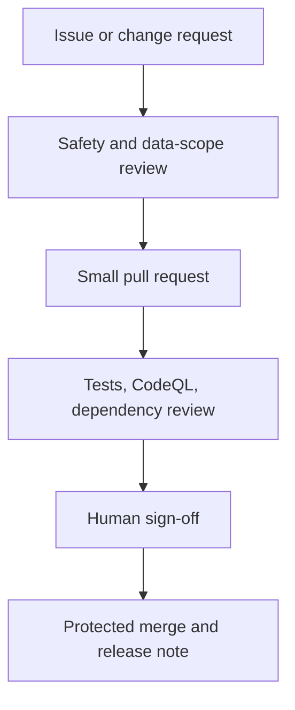

# Threat model and cyber-defense plan

## System context

B.L.O.W. Evidence Studio is a local Python package that validates a JSON record and writes a Markdown Evidence Integrity Card. It has no supported network, hardware, live-data, location, identity, tracking, or actuation capability.

## Assets to protect

| Asset | Why it matters |
| --- | --- |
| Source code and workflows | A malicious change could widen scope or introduce supply-chain compromise. |
| Approved fixtures | An unreviewed fixture could contain sensitive or misleading data. |
| Provenance and review fields | Losing them would make the report non-auditable. |
| Secrets and contributor accounts | A leak could enable repository takeover or data exposure. |
| Public claims and documentation | False performance or authority claims can cause harmful decisions. |

## Threats, controls, and verification

| Threat | Primary controls | Verification owner |
| --- | --- | --- |
| Malicious pull request | Branch protection, CODEOWNERS, required review, CodeQL, dependency review. | Maintainer |
| Dependency compromise | Minimal dependencies, Dependabot, dependency-review workflow, version review. | Maintainer |
| Secret leakage | Secret scanning, push protection, `.gitignore`, redacted issue policy. | Repository owner |
| Sensitive-data ingestion | Strict schema, data cards, authorization field, privacy review. | Data steward |
| Prompt injection or fabricated AI output | Source links, two-model critique for non-sensitive drafts, human sign-off, claim register. | Technical reviewer |
| Scope creep into live or physical action | Import-boundary tests, zero-actuation field, safety review gate. | Safety reviewer |
| False confidence or unsupported marketing | Explicit limitation fields; `measured`/`simulated`/`unverified` claim tags. | Product owner |
| Account takeover | MFA, least privilege, quarterly collaborator audit, protected main branch. | Repository owner |

## Secure development workflow

## Security tests in this repository

The test suite checks that the application package does not import common network, hardware, process-control, or runtime-control modules. The evidence schema also rejects identifier, location, trajectory, target, live-stream, and actuation fields.

These controls are guardrails, not a substitute for review. A maintainer must investigate every unexpected dependency, new workflow permission, new data field, or change to the safety boundary.

## Incident response

1. Freeze merges and revoke affected credentials.
2. Preserve a minimal, redacted audit trail; do not publish secrets or sensitive data.
3. Identify affected commits, dependencies, data, and releases.
4. Patch on a review branch; validate with tests, CodeQL, dependency review, and a human security review.
5. Publish a factual post-incident note with impact, remediation, and prevention steps.
6. Reassess permissions, data retention, and scope controls before reopening contributions.
